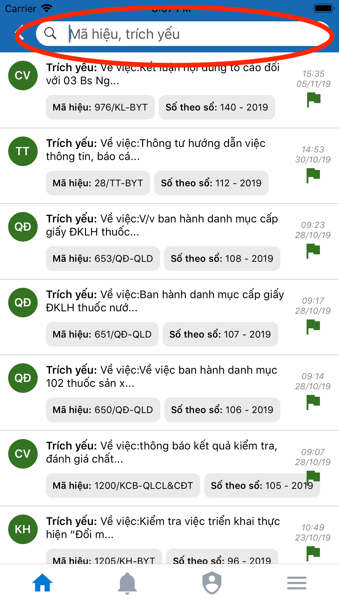
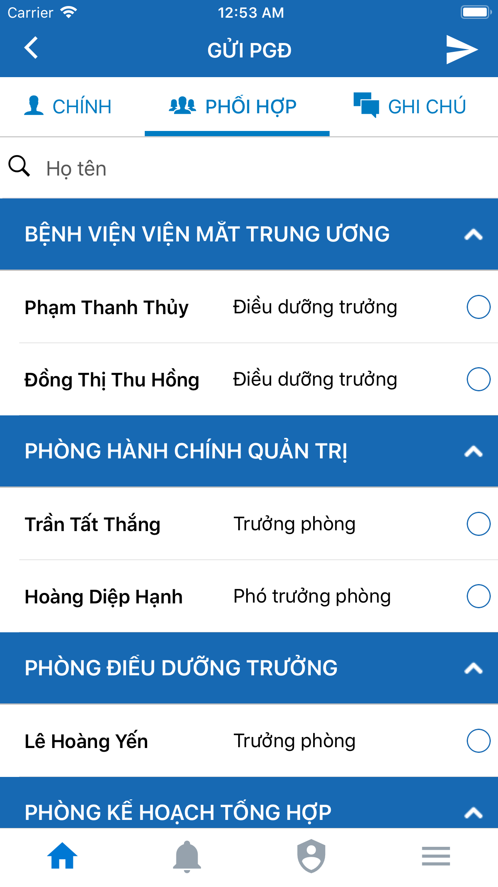
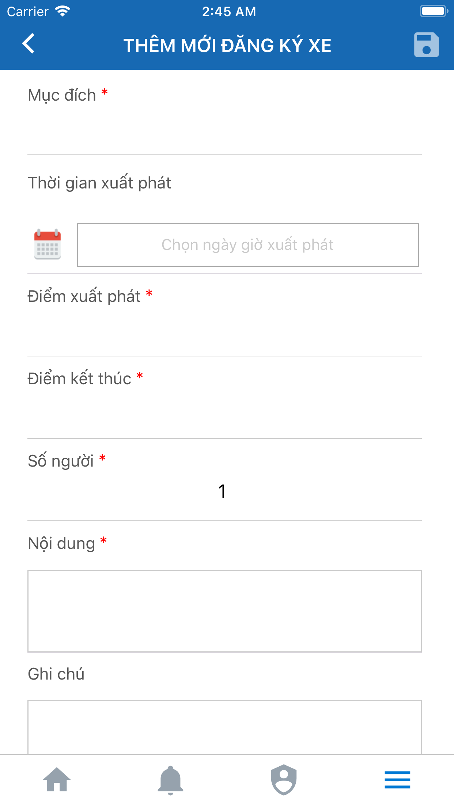
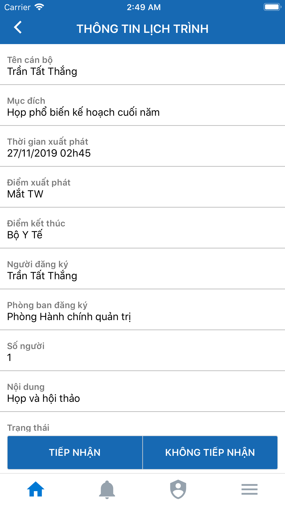

# 1. Giới thiệu
## 1.1 Mô tả

- Ứng dụng EofficeVNEH là giải pháp quản lý văn bản điều hành dành cho ứng dụng trên điện thoại di động. Ứng dụng giúp giảm thời gian và tăng năng suất cho việc theo dõi và xử lý các công việc liên quan đến văn bản trong bộ máy hành chính công hiện nay.
-	Ứng dụng tạo ra sự tiện lợi khi người dùng chỉ cần một chiếc điện thoại có cài ứng dụng và Internet là có thể theo dõi xử lý văn bản điều hành tại bất kỳ nơi đâu.
-	Ứng dụng sử dụng CSDL tập trung, dữ liệu đồng bộ với phiên bản web dành cho VNEH.
-	Ứng dụng hỗ trợ 2 hệ điều hành trên di động đó là: iOS và Android.

## 1.2 Tải về ứng dụng

-	Truy cập **CH Play** cho Androi, hoặc **App Store** đối với iOS
-	Gõ từ khóa **vneh** hoặc **eofficevneh** kết quả hiện ra như sau:

-	Bấm vào kết quả đầu tiên và chọn tải về

## 1.3 Giới thiệu các màn hình chính

-	Logo ứng dụng:

-	Màn hình đăng nhập ứng dụng

-	Màn hình sau khi đăng nhập ứng dụng

-	Màn hình danh sách thông báo

-	Màn hình danh sách chức năng chính

-	Màn hình tài khoản

# 2. Quản lý văn bản đến
## 2.1 Danh sách văn bản
### 2.1.1 Xem theo loại

- Các loại văn bản đến:
  * Chưa xử lý
  * Nội bộ chưa xử lý
  * Tham gia xử lý
  *	Đã xử lý
  *	Nội bộ đã xử lý
- Xem danh sách từng loại văn bản đến
  * Vào màn hình danh sách chức năng chính
  * Bấm chọn vào loại văn bản đến cần xem

### 2.1.2 Tìm kiếm

-	Trên mỗi danh sách văn bản đến đều có kèm theo một ô tìm kiếm cho phép người dùng nhập từ khóa để tìm kiếm văn bản
-	Các bước để tìm kiếm
  *	Bấm chọn vào ô tìm kiếm ở trên cùng của danh sách

  +	Trên màn hình hiển thị phím nhập, người dùng gõ vào từ khóa tìm kiếm để tìm kiếm văn bản 

## 2.2 Xem chi tiết văn bản

-	Ứng dụng cho phép người dùng xem thông tin chi tiết của văn bản đến bao gồm:
  *	Thông tin văn bản & tài liệu đính kèm
  *	Lịch sử xử lý
  *	Hồ sơ văn bản

- Xem chi tiết văn bản đến:
  *	Cách 1: Bấm vào các thanh menu hiển thị trên menu chính phía dưới phần tiêu đề

  * Cách 2:	Vuốt màn hình từ trái sang phải để xem theo trình tự: _Thông tin chung_ ==> _Lịch sử xử lý_. Hoặc vuốt từ phải qua trái theo trình tự ngược lại.

## 2.3 Gửi xử lý văn bản

-	Tại màn hình chi tiết, đối với các văn bản người dùng có quyền xử lý sẽ hiển thị các nút xử lý tương ứng tuỳ theo trạng thái của văn bản hiện tại và quyền của người dùng hiện thời

-	Bấm chọn nút xử lý khi đó ứng dụng sẽ chuyển sang màn hình xử lý văn bản
-	Trên màn hình xử lý lúc đó tùy theo cấu hình hệ thống sẽ hiển thị các menu:
  +	Chính (bắt buộc chọn): hiển thị danh sách người xử lý chính có phân cấp theo phòng ban. Nếu hệ thống không cấu hình thì menu này sẽ không hiển thị.

  +	Phối hợp (không bắt buộc chọn): hiển thị danh sách người phối hợp phân cấp theo phòng ban. Nếu hệ thống không cấu hình thì menu này sẽ không hiển thị. Cách lựa chọn và tìm kiếm tương tự với danh sách xử lý chính.

  +	Ghi chú (không bắt buộc nhập): phần nhập ghi chú xử lý văn bản đến, sẽ lưu lại trong lịch sử xử lý văn bản đến.

  + Gửi xử lý: Bấm chọn ô mũi tên trên cùng bên phải màn hình để gửi xử lý văn bản

# 3. Quản lý văn bản đi
## 3.1 Danh sách văn bản
### 3.1.1 Xem theo loại

- Các loại văn bản đi:
  * Chưa xử lý
  * Tham gia xử lý
  *	Đã xử lý
  *	Đã ban hành
- Xem danh sách từng loại văn bản đi
  * Vào màn hình danh sách chức năng chính
  * Bấm chọn vào loại văn bản đi cần xem

### 3.1.2 Tìm kiếm

-	Trên mỗi danh sách văn bản đi đều có kèm theo một ô tìm kiếm cho phép người dùng nhập từ khóa để tìm kiếm văn bản
-	Các bước để tìm kiếm
  *	Bấm chọn vào ô tìm kiếm ở trên cùng của danh sách

  +	Trên màn hình hiển thị phím nhập, người dùng gõ vào từ khóa tìm kiếm để tìm kiếm văn bản 

## 3.2 Xem chi tiết văn bản

-	Ứng dụng cho phép người dùng xem thông tin chi tiết của văn bản đi bao gồm:
  *	Thông tin văn bản & tài liệu đính kèm
  *	Lịch sử xử lý
  *	Hồ sơ văn bản

- Xem chi tiết văn bản đi:
  *	Cách 1: Bấm vào các thanh menu hiển thị trên menu chính phía dưới phần tiêu đề

  * Cách 2:	Vuốt màn hình từ trái sang phải để xem theo trình tự: _Thông tin chung_ ==> _Lịch sử xử lý_. Hoặc vuốt từ phải qua trái theo trình tự ngược lại.

## 3.3 Gửi xử lý văn bản

-	Tại màn hình chi tiết, đối với các văn bản người dùng có quyền xử lý sẽ hiển thị các nút xử lý tương ứng tuỳ theo trạng thái của văn bản hiện tại và quyền của người dùng hiện thời

-	Bấm chọn nút xử lý khi đó ứng dụng sẽ chuyển sang màn hình xử lý văn bản
-	Trên màn hình xử lý lúc đó tùy theo cấu hình hệ thống sẽ hiển thị các menu:
  +	Chính (bắt buộc chọn): hiển thị danh sách người xử lý chính có phân cấp theo phòng ban. Nếu hệ thống không cấu hình thì menu này sẽ không hiển thị.

  +	Phối hợp (không bắt buộc chọn): hiển thị danh sách người phối hợp phân cấp theo phòng ban. Nếu hệ thống không cấu hình thì menu này sẽ không hiển thị. Cách lựa chọn và tìm kiếm tương tự với danh sách xử lý chính.

  +	Ghi chú (không bắt buộc nhập): phần nhập ghi chú xử lý văn bản đi, sẽ lưu lại trong lịch sử xử lý văn bản đi.

  + Gửi xử lý: Bấm chọn ô mũi tên trên cùng bên phải màn hình để gửi xử lý văn bản

# 4. Quản lý công việc
## 4.1 Xem theo loại

- Các loại công việc:
  * Chưa xử lý
  * Tham gia xử lý
  *	Đã xử lý
  *	Đã ban hành
- Xem danh sách từng loại công việc
  * Vào màn hình danh sách chức năng chính
  * Bấm chọn vào loại công việc cần xem

### 4.1.2 Tìm kiếm

-	Trên mỗi danh sách công việc đều có kèm theo một ô tìm kiếm cho phép người dùng nhập từ khóa để tìm kiếm công việc
-	Các bước để tìm kiếm
  *	Bấm chọn vào ô tìm kiếm ở trên cùng của danh sách

  +	Trên màn hình hiển thị phím nhập, người dùng gõ vào từ khóa tìm kiếm để tìm kiếm công việc 

## 4.2 Xem chi tiết công việc

- Xem mô tả công việc: Người dùng nhấn vào một công việc trên danh sách phía trên, ứng dụng sẽ hiển thị mô tả công việc và tài liệu đính kèm (nếu có)

Ngoài ra, để xem các màn hình danh sách liên quan đến công việc hiện hành, hãy chú ý xuống các nút bấm ở cuối màn hình:

- Xem danh sách việc con: nhấn chọn nút _Các công việc con_
- Xem lịch sử cập nhật tiến độ: nhấn chọn nút _Theo dõi tiến độ_
- Xem lịch sử lùi hạn: nhấn chọn nút _Lịch sử lùi hạn_
- Xem lịch sử phản hồi: nhấn chọn nút _Lịch sử phản hồi_

## 4.3 Xử lý công việc

Để bắt đầu xử lý 

### 4.3.1 Giao việc

### 4.3.2 Cập nhật tiến dộ
### 4.3.3 Gia hạn công việc
### 4.3.4 Tạo công việc con
### 4.3.5 Bình luận

# 5. Lịch công tác

Lịch công tác được tích hợp thẳng vào màn hình đầu tiên sau khi đăng nhập, với ngày được bôi đỏ tương ứng với ngày hiện tại.

Người dùng có thể xem lịch công tác của ngày khác bằng cách nhấn vào ngày tương ứng; và xem lịch của tuần khác bằng cách nhấn vào hai phím mũi tên được khoanh tròn ở hai đầu trái phải.

Khi nhấn vào một lịch nào trong danh sách phía dưới, người dùng sẽ chuyển vào trang chi tiết có dạng như sau:

Tại đây, ứng dụng cho phép người dùng đặt xe hoặc đặt lịch họp nếu cần thiết. Và nếu lịch công tác nào đã được trùng lịch họp thì ứng dụng sẽ tự lấy lịch họp tương ứng để gắn vào.

Chi tiết về phần lịch xe và lịch họp sẽ được giải thích thêm trong phần tiện ích phía dưới

# 6. Uỷ quyền

Ứng dụng hỗ trợ tạo thông báo uỷ quyền đối với một số tài khoản có vai trò là Trưởng phòng hoặc Giám đốc. Các bước thực hiện như sau:

- Vào màn hình danh sách thông báo (người dùng nhần vào biểu tượng chuông trên menu bên dưới), và chọn dấu cộng phía dưới góc phải màn hình

- Nhập các nội dung tương ứng và nhấn lưu. Sau khi lưu lại, thông báo uỷ quyền sẽ hiển thị như một thông báo, ghim trên màn hình sau khi đăng nhập và màn hình danh sách thông báo, trong khoảng thời gian như người dùng đã đặt khi thêm mới

# 7. Người dùng

## 7.1 Thông tin tài khoản

Để xem thông tin tài khoản, người dùng nhấn vào biểu tượng người trên menu dưới cùng để vào màn hình tài khoản. Tại đây hiển thị phần lớn các thông tin chính của người dùng, nếu thông tin nào không có hoặc chưa được cập nhật thì sẽ hiển thị là _(Không có)_

## 7.2 Cập nhật thông tin

Trên màn hình thông tin tài khoản phía trên, chọn nút _Sửa thông tin_, ứng dụng chuyển qua màn hình sửa thông tin như sau.

Người dùng có thể chọn nhập thay đổi thông tin tuỳ ý, rồi chọn lưu để lưu lại thông tin vừa thay đổi. Với những trường thông tin không đổi, ứng dụng sẽ lấy lại các thông tin cũ (nếu có).

## 7.3 Đổi mật khẩu

Trên màn hình thông tin tài khoản phía trên, chọn nút _Đổi mật khẩu_, ứng dụng chuyển qua màn hình sửa thông tin như sau.

Tại đây người dùng phải nhập hai lần mật khẩu của mình. Mật khẩu có thể tuỳ ý theo người dùng, không bắt buộc dài ngắn.

# 8. Tiện ích

Để vào được phần tiện ích, người dùng có thể vuốt xuống cuối trong phần màn hình xử lý chính.

Hoặc chọn nút _Tiện ích_ trên màn hình ban đầu

## 8.1 Lịch họp

### 8.1.1 Danh sách lịch họp

Ở màn hình hiển thị danh sách tiện ích, nhấn nút _Lịch họp_, ứng dụng sẽ thể hiện danh sách lịch họp dưới dạng như sau:

Người dùng có thể xem lịch họp của các ngày bằng cách nhấn vào từng ngày theo lịch hiển thị phía trên, hoặc bằng thao tác vuốt lên trên/ vuốt xuống dưới.

### 8.1.2 Đặt lịch họp

Để thêm mới, hãy nhấn vào nút tròn có dấu cộng ở góc phải bên dưới màn hình.

### 8.1.3 Chi tiết lịch họp

Sau khi nhập xong các trường thông tin và bấm lưu. Ứng dụng sẽ trả về trang chi tiết lịch họp như sau:

Nếu người dùng chưa chọn phòng họp trong lúc thêm mới, thì có thể chọn phòng họp sau đó (tuy nhiên, chỉ những người có quyền đặt phòng mới có thể lựa phòng họp cho lịch).

## 8.2 Lịch trực - lịch phòng khám

Ở màn hình hiển thị danh sách tiện ích, nhấn nút _Lịch trực - lịch phòng khám_, ứng dụng sẽ thể hiện danh sách dưới dạng như sau:

Từ danh sách lịch trực, muốn sang danh sách lịch khám thì nhấn vào biểu tượng dấu ba chấm ở góc trên bên phải màn hình, và chọn lịch khám. Người dùng thao tác tương tự khi chuyển ngược lại từ lịch khám sang lịch trực

## 8.3 Lịch trình xe

### 8.4.1 Danh sách lịch trình

Ở màn hình hiển thị danh sách tiện ích, nhấn nút _Lịch trình xe_, ứng dụng sẽ thể hiện danh sách dưới dạng như sau:

### 8.4.2 Thêm mới đăng ký xe

Để thêm mới, hãy nhấn vào nút tròn có dấu cộng ở góc phải bên dưới màn hình.

Sau khi điền đầy đủ thông tin (ít nhất là các thông tin được đánh dấu sao đỏ), và nhấn lưu. Ứng dụng sẽ chuyển qua màn hình chi tiết đăng ký xe.

### 8.4.3 Gửi yêu cầu

Tại đây người dùng có thể chọn gửi yêu cầu để người có quyền tiếp nhận bố trí xe cho; hoặc huỷ yêu cầu.

### 8.4.4 Tiếp nhận đăng ký xe

Đối với tài khoản của người có quyền tiếp nhận, người dùng đó có thể chọn tiếp nhận hoặc không tiếp nhận.

Nếu chọn tiếp nhận, ứng dụng chuyển sang màn hình chọn xe và lái xe như bên dưới. Người dùng chọn dấu mũi tên trên cùng bên phải màn hình để lưu lại thông tin tiếp nhận.

Sau khi tiếp nhận xong, màn hình chi tiết lịch trình xe sẽ có thêm thông tin về chuyến.

## 8.4 Nhắc việc

### 8.4.1 Danh sách nhắc việc

Ở màn hình hiển thị danh sách tiện ích, nhấn nút _Nhắc việc_, ứng dụng sẽ thể hiện danh sách nhắc việc dưới dạng như sau:

Người dùng có thể xem các nhắc việc của các ngày bằng cách nhấn vào từng ngày theo lịch hiển thị phía trên, hoặc bằng thao tác vuốt lên trên/ vuốt xuống dưới.

### 8.4.2 Thêm mới nhắc việc

Để thêm mới, hãy nhấn vào nút tròn có dấu cộng ở góc phải bên dưới màn hình.

Với một số tài khoản có quyền thêm mới nhắc việc cho người khác (như tài khoản của Thư ký), ứng dụng cho phép chọn người được nhắc việc.

## 8.5 Kết luận giao ban

Ở màn hình hiển thị danh sách tiện ích, nhấn nút _Kết luận giao ban_, ứng dụng sẽ thể hiện danh sách dưới dạng như sau:

Người dùng có thể xem các kết luận giao ban của từng ngày, và tải xuống bằng cách nhấn vào biểu tượng mũi tên đi xuống ở góc phải của từng kết luận.

**Thành thật cảm ơn!**